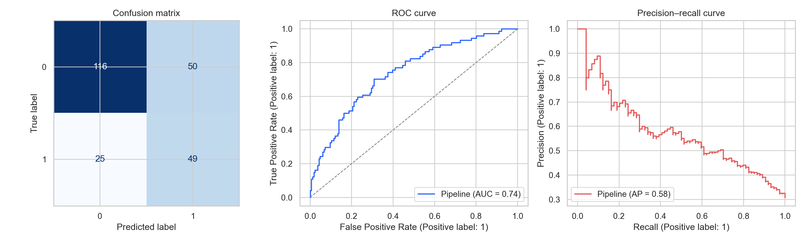
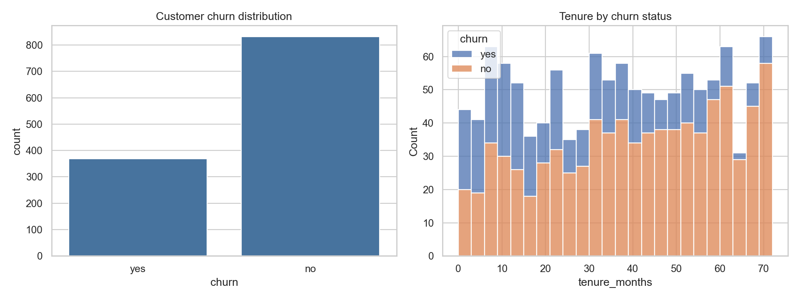
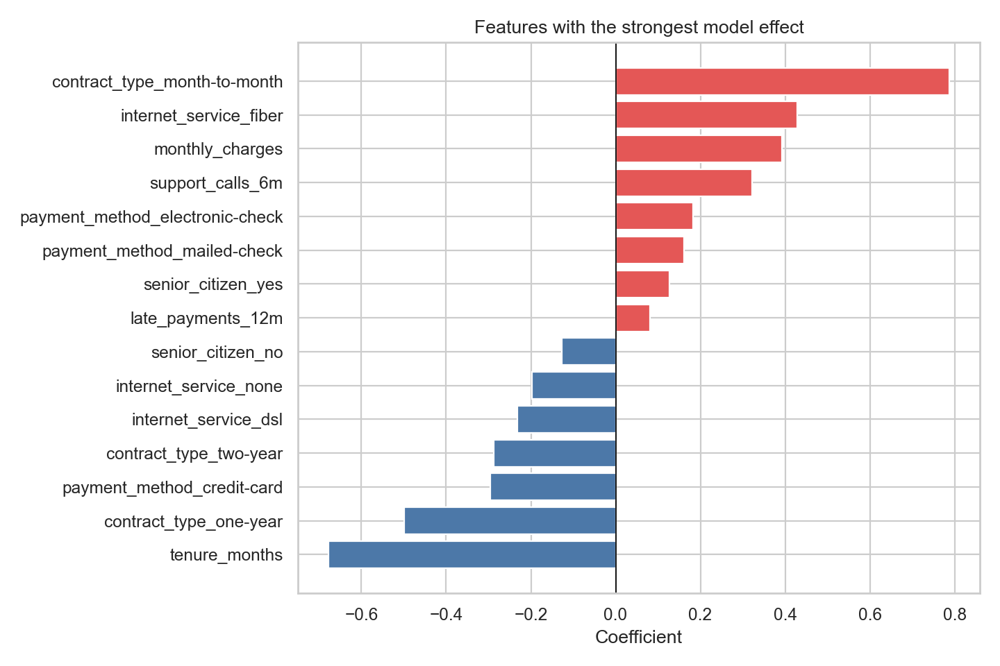

# Customer Churn Prediction

This started as a small classification exercise and grew into a full training and prediction pipeline. The goal is simple: given what we know about a telecom customer, estimate how likely they are to leave.

I could not include real customer records, so the project comes with a script that generates sample data. It creates account, billing and usage fields such as contract type, tenure, monthly charges, support calls and late payments. A few values are deliberately left missing to make sure the cleaning steps are actually used.

The sample data is useful for running the code, but the resulting model is only a demo. It should not be used to make decisions about real customers.

## Approach

I kept the preparation steps and the estimator in the same scikit-learn pipeline. Numeric columns are filled with the median and scaled. Categorical columns are filled with their most common value and one-hot encoded. This happens separately inside each cross-validation fold, which prevents information from the validation data leaking into training.

I tried Logistic Regression and Random Forest as a starting point. The models are compared with five-fold stratified cross-validation, using ROC-AUC as the selection metric. The better model is tuned with grid search and evaluated on a held-out test set.

For the current sample of 1,200 customers, Logistic Regression performed better. These were the final test results:

| Metric | Score |
| --- | ---: |
| Accuracy | 0.688 |
| Precision | 0.495 |
| Recall | 0.662 |
| F1 | 0.567 |
| ROC-AUC | 0.740 |



The model catches roughly two thirds of the customers who churn, although about half of its positive predictions are false alarms. In a real retention campaign, I would not automatically use the default 0.5 cutoff. The threshold should depend on the cost of contacting a customer, the value of retaining them and the number of cases the retention team can handle.

## What I noticed

Customers on month-to-month contracts have a higher churn rate in the sample. Longer-tenure customers are less likely to leave, while repeated support calls and late payments push the prediction in the other direction.

Those patterns are expected because they are part of the logic used to generate the sample data. The charts are a check that the pipeline can recover a sensible signal, not a business finding.



The chart below shows the largest coefficients from the selected Logistic Regression model. Red bars move a prediction towards churn and blue bars move it away from churn.



## Running it

The project requires Python 3.10 or later.

```bash
python3 -m venv .venv
source .venv/bin/activate
pip install -e '.[dev,app]'
```

Generate the sample data and train the models:

```bash
make data
make train
```

The training command saves the fitted pipeline, model scores, feature effects and charts in `artifacts/`.

To score a CSV with the trained model:

```bash
churn predict \
  --data data/customer_churn.csv \
  --model artifacts/churn_model.joblib \
  --output artifacts/predictions.csv
```

To open the small Streamlit interface:

```bash
make app
```

Then visit the local address shown in the terminal, normally `http://localhost:8501`.

Run the tests with:

```bash
make test
```

## Using another dataset

The training CSV needs a column called `churn`. Labels can be `yes/no`, `true/false` or `1/0`. If there is a `customer_id` column, it is kept out of the model automatically. Other columns are detected as numeric or categorical.

Prediction data should contain the same feature columns used for training. The output contains the original rows plus `churn_probability` and `predicted_churn`.

## Files worth looking at

- `notebooks/churn_analysis.ipynb` contains a shorter walkthrough of the analysis.
- `src/churn_prediction/modeling.py` contains the training and model-selection code.
- `src/churn_prediction/data.py` handles input validation and sample-data generation.
- `src/churn_prediction/reporting.py` creates the evaluation plots.
- `app.py` is the Streamlit prediction form.
- `MODEL_CARD.md` records the intended use and limitations.

There is also a Dockerfile if you would rather run the app in a container:

```bash
docker build -t churn-prediction .
docker run --rm -p 8501:8501 churn-prediction
```

## Possible next steps

The most useful next step would be testing the pipeline on real, time-based customer data. I would also look at probability calibration, tune the decision threshold around an actual retention budget and monitor whether the input distribution changes after deployment.

Licensed under the MIT License.
